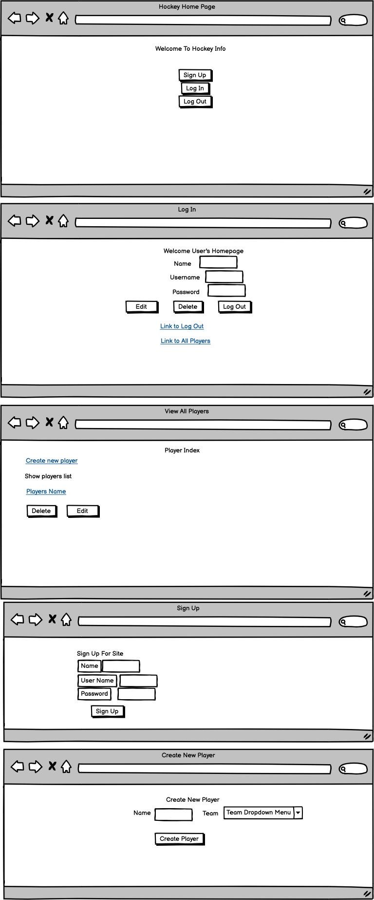

## Deere Project 2 Starter Code

## Set Up

1. Fork and clone this repo
1. `cd` into the folder and run `npm install`
1. In the root of your app, `touch .env` and add:

   ```bash
   PORT=3000
   JWT_SECRET=pancakes
   ```

1. Check out your `config/config.json` file. You'll need to create a database called `project2_development`
1. Sequelize is included in the app. You have a `User` model. Run `db:migrate` to create the `Users` table in your database.
1. Run `nodemon` and go to the Homepage: `localhost:3000/`


<br>

## Routes

You have the following routes available.

#### controllers/authController.js

- GET and POST `localhost:3000/auth/signup`
- GET and POST `localhost:3000/auth/login`
- GET `localhost:3000/auth/logout`

#### controllers/usersController.js

- GET `localhost:3000/profile/:id`

<br>
Approach Used
Wireframing to visualize the layout of the pages. 


Project location
https://github.com/HenryScottG/deere-project2-starter

User Stories
 * As a user, I should be able to have the option to log in or sign up to the site.
 * As a user, I should be able to see my profile and edit it. 
 * As a user, I should be able to see a list of the players.
 * As a user, I should be able to click a button to edit a player.
 * As a user, I should be able to click a button to add a player.
 * As a user, I should be able to delete a player.
 * As a user, I should be able to click a drop down to select the team for a new player.
 * As a user, I should be able have a log out button.
 * As a user, I should be able to click a link on some pages to get to the players index.
 * As a user, I should be able to see players profile.
 * As a user, I should be able to see the data that was seeded in pgAdmin.
 * As a user, I should be able to see the data change in pgAdmin.

Tecnologies Used
* A working full-stack application using Node.js, Postgres, Express and EJS.
* Adhere to the MVC file structure: Models, Views, Controllers.
* At least one model with all 7 RESTful routes and full CRUD.
* At least 2 models that are associated in some way (e.g. one-to-many, many-to-many, etc).
* GitHub

Struggles
* Routing for both users and players.
* Page layout using css.
* Associations with multiple tables. 
* Seeding the tables with available data from a hockey resourse.
* Time management - where something is broke, work on something else until assistance is available. 

Future Enhancements
* Update the Search feature to find players.
* Update the Contact Us have a form.
* Better CSS layout.
* Authentication.
* Update the profile page to display all information.

Lessons Learned
* Work on one route at a time.
* Better understanding for how table integrate.

## Additional Resources

- [Fruit App Solution](https://git.generalassemb.ly/jdr-0622/fruit-app-in-class)
- [Pokemon Express Solution](https://git.generalassemb.ly/jdr-0622/pokemon-express-sequelize6)
- [Google Routes Spreadsheet](https://docs.google.com/spreadsheets/d/14-LHKXLtEkp_vKEz3qSKjREnrmSyzQ9fimTlmrPsZsQ/edit#gid=0)
- [JSON Web Tokens](https://jwt.io/)
